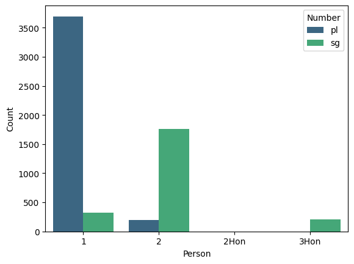

---
output:
  beamer_presentation:
    pdf-engine: xelatex
    listings: true
title: APC detector
subtitle: BERT-based token classification for nominal person in German
author: Georg F.K. Höhn
short-author: Höhn
institute: Ironhack
date: 4 July 2025
section-titles: true
tables: true
indent: true
theme: metropolis
themeoptions: |
  | block=transparent
bibliography: /home/georg/academia/BibTeXreferences/literature.bib
babel-lang: english
lang: en-GB
language: english
mainfont: Linux Biolinum
monofont: DejaVu Sans Mono
fontsize: 13pt
papersize: a4paper
numbersections: true
csquotes: true
---

## Project overview

### Adnominal pronoun constructions (APCs)

\pex \a \alert{we} linguists
\a \begingl
\gla \rightcomment{German}\alert{wir} Linguisten//
\glb we linguists//
\endgl
\xe

### Challenges

- hard to detect automatically
- limited empirical data on distribution
- available tagged dataset not publishable due to copyright

### Aim

- use tagged dataset to train BERT-transformer for high-accuracy automatic detection (for German)

:::: {.columns}
::: {.column width="50%"}

:::
::: {.column width="50%"}

:::
::::

## Outline

\tableofcontents

# Background

## Nominal person

- expressions marking whether a speech act participant (author, addressee) is part of the reference set of a nominal expression
- APCs are one type, other examples:

\pex \a clitic person marking 
\begingl
\gla \rightcomment{Alamblak}yima-\alert{nëm}//
\glb person-1\Pl{}//
\glft "we people" [@bruce1984, 96, (158)]//
\endgl
\a \begingl
\gla \rightcomment{Lavukaleve}aka [\alert{malav} \alert{e}] roa-ru kiu-la-m.//
\glb then people 1\Pl.\Excl{} one.\Sg.\M-none die-\Neg-\Sg.\M//
\glft "And we, the people [lit: the people we] didn't die. [i.e. None of us people died.]" [@terrill2003, 171]//
\endgl
\xe

## Crosslinguistic variation

- presence of definite article, possibly related to "unagreement" (ability to drop the pronoun)

\pex \a \begingl
\gla \rightcomment{Castilian}[(\alert{Nosotras}) \alert{las} \alert{mujeres}] denuncia-mos + las injusticias.//
\glb we.\F{} \Det.\Pl.\F{} women denounced-1\Pl{} \Det.\Pl{} injustices//
\glft "We women denounced the injustices." [after @hurtado1985, 187, (1)]//
\endgl
\xe

- singular contexts restricted in English, fine in German

\ex \begingl
\gla \rightcomment{German}[\alert{Ich} \alert{Vulkanier}] habe Dinge gesehen, die + [\alert{du} \alert{Mensch}] dir nicht vorstellen kannst.//
\glb 1\Sg.\Nom{} Vulcan have things seen \Rel.\Acc.\Pl{} 2\Sg.\Nom{} human 2\Sg.\Dat{} \Neg{} imagine can.2\Sg{}//
\glft "\*I Vulcan have seen things that you human cannot imagine." [after @rauh2003]//
\endgl
\xe

## Person-number

- no adnominal third person APCs in many (European) languages 

\pex \a \ljudge{*}\alert{They linguists} are concerned with strange issues.
\a \begingl
\gla \rightcomment{Hoava}Kipu mae [\alert{ria} \alert{nikana} \alert{Japani}] de + [\alert{γami} \alert{nikana} \alert{hupa}] mae ŋani=i [γami].//
\glb \Neg{} come 3\Pl{} man Japanese \Purp{} 1\Excl.\Pl{} man be.black come kill=\Acc{} 1\Excl.\Pl{}//
\glft "The Japanese men did not come to come and kill us black men." [@palmer2017, 426]//
\endgl
\xe

## 

- a possible correlation between third person adnominal pronouns and definite articles? [@hoehn2020ThirdGap]

# Practical challenges

## 

- few corpus investigations on nominal person/APCs [@keizer2016 uses data from BNC], although lots of potential:
  - language-internal distribution (genre, information structure) 
  - relationship to definiteness
  - relationship between different types of nominal person (APCs and unagreement)
  - crosslinguistic differences in frequency of use

- identifying APCs in POS-tagged corpora is time/work-intensive
  - many false positives
  - capturing intervening modifiers requires more complex queries $\rightarrow$ even more false hits

## 

### Modifiers

\pex
\a \begingl
\gla \alert{ihr} armen kleinen \alert{Deutschen}//
\glb you.\Pl{} poor little Germans//
\endgl
\a \begingl
\gla \alert{du} von großer Sorge geplagter \alert{Anführer} der Achaier//
\glb you.\Sg{} by great sorrow tormented leader \Det.\Gen.\Pl{} Achaeans//
\glft "you leader of the Achaeans who are(is?) tormented by great sorrow"//
\endgl
\xe

### Some potential false positives

\pex \a I told [\alert{you}] [\alert{linguists} are great].
\a \begingl
\gla Gestern haben [\alert{wir}] [\alert{Linguisten} gesehen].//
\glb yesterday have.1\Pl{} \phantom{[}we \phantom{[}linguists seen//
\glft "Yesterday we saw linguists."//
\endgl
\xe

# Methodology

## Manually tagged datasets

- manual pattern searches in POS-tagged corpora
  - English: British National Corpus (BNC)  
    96,986,707 tokens
  - German: Digitales Wörterbuch der deutschen Sprache (DWDS), Kernkorpus 1900--1999  
    121,494,429 tokens
- hits collated into tables with metainformation (search pattern, year, bibliographic reference etc.) + context 
- annotation for APC + further linguistic properties
  - many thanks to Andrea Schröter, Maya Galvez Wimmelmann and Carolin Kuna for their work!
- unfortunately strict licensing conditions on the corpora preclude publication of the annotated datasets 

## Training dataset

:::: {.columns}
::: {.column width="50%"}

45,539 hits:

- no APC: 39,239  
- APC: 6,188

:::
::: {.column width="50%"}

:::
::::

\begin{table}[htb]
\caption{Precision for APC search by pronoun}
\begin{tabular}{lccccc}
\toprule
				& \textbf{ich} & \textbf{du} & \textbf{wir} & \textbf{ihr} & \textbf{Sie}\\
\midrule
\textbf{total hits} 		& 14,771	& 5,285	& 17,939	& 2,623		& 4,756\\
\textbf{APCs identified}	& 327		& 1,753	& 3,690		& 202		& 208\\
\midrule
\textbf{Precision} (in \%)	& 2.214		& 33.17	& 20.57		& 7.7		& 4.37\\
\bottomrule
\end{tabular}
\end{table}

## 

\ex \begingl
\gla Und er wollt dir einen Groschen schenken, und er spielte mit \alert{dir} \alert{Räuber} und Gendarm.//
\glb and he wanted you.\Sg.\Dat{} a twopence gift and he played with you robber and cop// 
\glft "and he wanted to give you a twopence and he played cops and coppers with you." (ID 16413)//
\endgl
\xe

##

## Relative frequency

\ex n of APC\unt{PersNum} \* 100 / number of pronouns\unt{PersNum} \xe

- counts of pronouns contain only those that were not blocked from display for copyright reasons, since APC checking was necessarily restricted to the accessible examples

\begin{table}[htb]
\caption{Relative frequency of APCs by pronoun}
\begin{tabular}{lccccc}
\toprule
							& \textbf{ich} & \textbf{du} & \textbf{wir} & \textbf{ihr} & \textbf{Sie}\\
\midrule
\textbf{pronoun count} 		& 587,893	& 119,295	& 322,350	& 120,512	& N/A\\
\textbf{APCs identified}	& 327		& 1,753		& 3,690		& 202		& 208\\
\midrule
\textbf{APC freq} (in \%)& 0.056	& 1.47		& 1.447		& 0.168		& N/A\\
\bottomrule
\end{tabular}
\end{table}

## Approach 

- using huggingface's `Trainer` with pre-trained base model: [`bert-base-german-cased`](https://huggingface.co/google-bert/bert-base-german-cased)

### Token-level classification

- prominently used in named entity recognition
- tokenized items get one of three labels
  - B-APC: **beginning** of the construction
  - I-APC: **inside** the construction
  - O: **outside** the construction (majority of tokens)
- model learns to apply these labels to new input

\ex \begingl
\gla AMD Radeon is a brand name by Advanced Micro Devices (AMD)//
\glb B-BRAND I-BRAND O O O O O B-COMP I-COMP I-COMP I-COMP//
\endgl
\xe

## Training data structure

- reduced version of annotated dataset
- retaining 
  - `ContextBefore`, `Hit`, `ContextAfter`: strings
  - `instance`: marking whether row contains an APC (1) or not (0)
    - simplified externally in EDA (original annotation has several other levels)
  - `APC`: string of the concrete APC
- one row per (potential) APC instance $\rightarrow$ sentences with more than one (potential) APC occur in multiple rows

## Data pre-/post-processing (`APCData` class)

- organises raw data into appropriate format for the trainer
- input: structured csv or raw text
  - raw text gets split into a table with triples of (previous sentence, focus sentence, following sentence)
- methods for `training=True` dataset
  - generate BIO-labels
  - merge BIO-labels in duplicate sentences to ensure full annotation, remove duplicates
  - create train-val-test split and BERT-tokenize to new dataset
- methods for `training=False` dataset
  - sentence tokenize input and split into overlapping triples
  - import predictions from inference and align with tokenization
  - de-tokenize texts and filter for APCs (and optionally pronouns)
- shared method: BERT-tokenization
  - chunking to avoid hitting maximum length of 512 tokens

# Model evaluation

##

\dummy{
  \begin{table}[htb!]
  \begin{tabular}{rcccccc}
  \toprule
  \multicolumn{2}{r}{\textbf{train}} & \multicolumn{5}{l}{\textbf{validation}}\\
  epoch	 & loss	& loss & accuracy	& F1 &	precision &	recall\\
  \midrule
  1 &	0.0110 & 	0.00996 &	0.99699 &	0.99699 &	0.99699 &	0.99699\\
  2	& 0.0049 &	0.01134 &	0.99716 &	0.99716 &	0.99716 &	0.99716\\
  3	& 0.0022 &	0.01420 & 0.99718 &	0.99718 &	0.99718 &	0.99718\\
  \midrule
  & & \multicolumn{5}{l}{\textbf{test}}\\
  &           & 0.00955 & \alert{0.99667} & 0.99667 & 0.99667 & 0.99667\\
  \bottomrule
  \end{tabular}
  \caption{Evaluation metrics for training }
  \end{table}
}

- model size: about 415 MB
- almost 99.7% accuracy
- no detailed analysis of possible partial mis-/matches [e.g. @tjongetal2003CoNNLU]

# Quick demo

## Streamlit app

- choose input
  - direct text input
  - text file
- choose output
  - only detected APCs
  - detected APCs and personal pronouns 
    - allows identification of false negatives and calculation of rel.freq.
- display results as DataFrame
  - works cumulatively
- save results as csv

# Conclusion and outlook

## 

- transformers offer a promising avenue for relatively reliable identification of APCs
- trade-off: large-ish model size at 415 MB

### Notes

- beware of interactions of batched tokenisation and chunking of long datarows
  - batching of huggingface Dataset.map() does *not* work if rows are added during batch processing due to chunking

##

### Further evaluation

- create systematic test set of difficult data types
- comparing up- and downwards
  - export test set as csv, compare performance of LLMs
  - build smaller models and compare performance

### Some extensions

- extend APCData to allow import of csv files for testing as well
- train and include model for English data
- more options for data output (bracketed APCs, full dataset as plain text)
- inferencing larger dataset (including difficult cases)
  - check manually for gold-standard $\rightarrow$ further model training 

## 

\centering\LARGE Thanks for your attention 

\Large and a pleasant and productive 9 weeks!

## References {.allowframebreaks}

\small
\setlength{\parindent}{-0.2in}
\setlength{\leftskip}{0.2in}
\setlength{\parskip}{3pt}